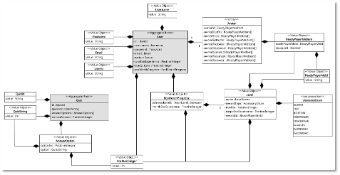
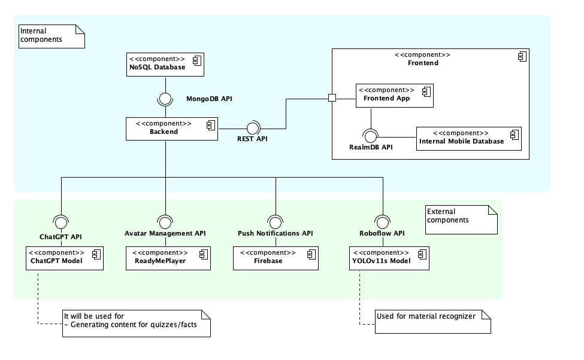
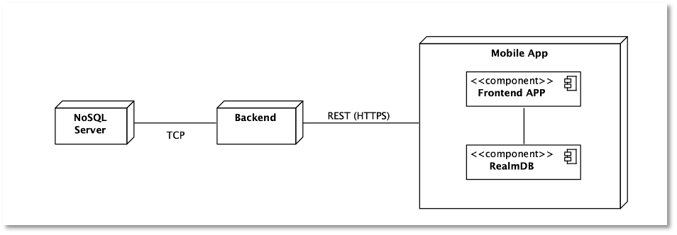
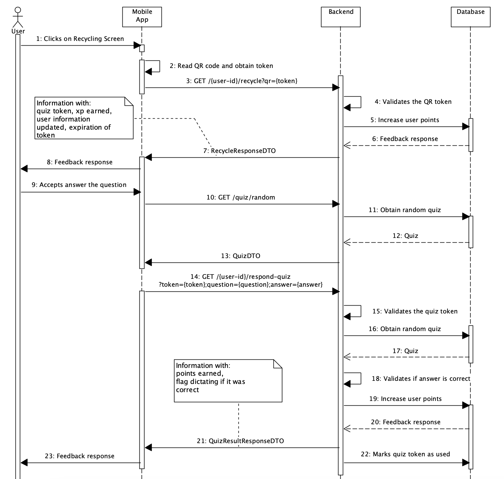
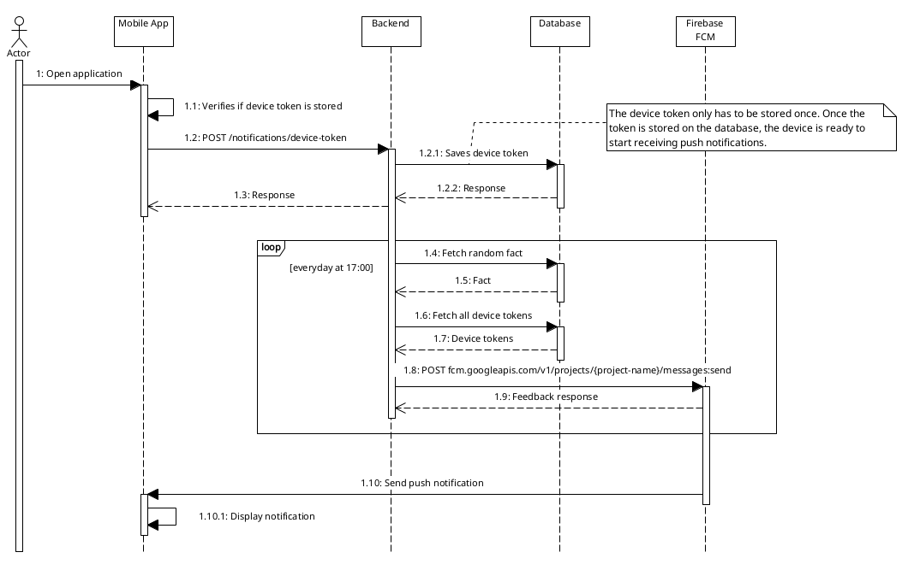
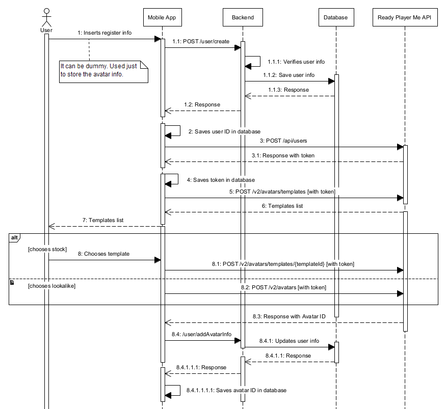
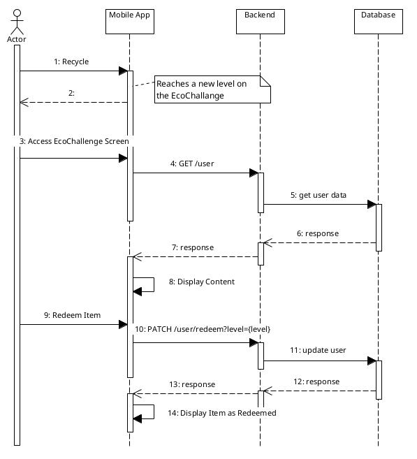
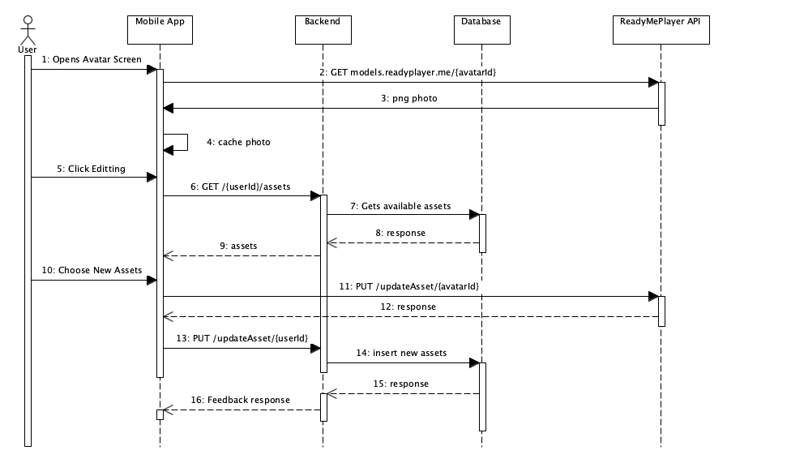
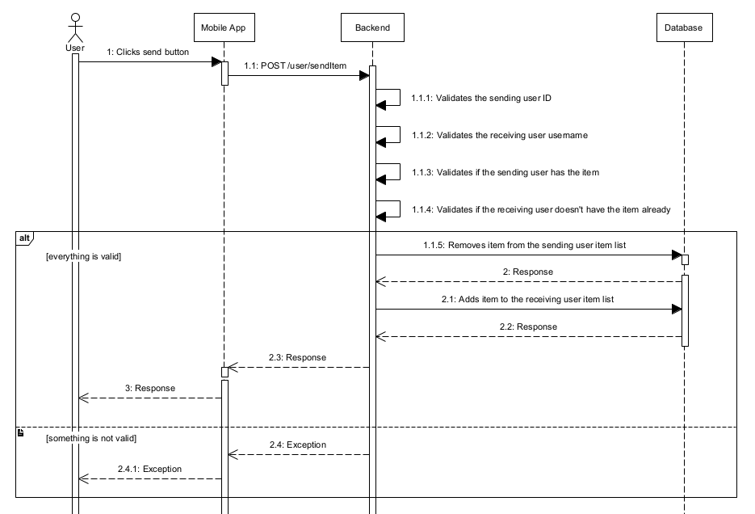
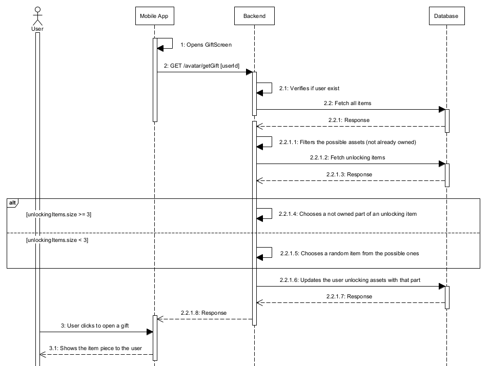

<h1> Ecoloop </h1>

- [Product Vision](#product-vision)
- [Domain Model](#domain-model)
- [Architecture](#architecture)
- [Important Flows](#important-flows)
  - [Recycling Process](#recycling-process)
  - [Material Recognition Process](#material-recognition-process)
  - [Push Notifications Process](#push-notifications-process)
  - [Register User Process](#register-user-process)
  - [Stock Avatar and Lookalike Avatar Pick Process](#stock-avatar-and-lookalike-avatar-pick-process)
    - [Stock Avatar](#stock-avatar)
    - [Lookalike Avatar](#lookalike-avatar)
  - [Login User Process](#login-user-process)
  - [Redeem Item Process](#redeem-item-process)
  - [Visualization and Editing of Avatar Process](#visualization-and-editing-of-avatar-process)
  - [Send Item Process](#send-item-process)
  - [Open Gift Process](#open-gift-process)

## Product Vision

Recycling is a fundamental pillar in preserving the environment and building a sustainable future. However, many municipalities face the challenge that some people lack the initiative or encouragement to make this practice part of their daily lives. Furthermore, even those who do recycle often do it incorrectly. When inappropriate materials, such as contaminated or non-recyclable items, are placed in the bins, they can disrupt the whole process, leading to more waste and higher costs.

To address these issues, an application can be designed to engage people in recycling correctly through gamified and educational features. Each user would have a customizable avatar that earns accessories based on their performance in educational quizzes related to recycling and sustainability. After recycling, users can take these quizzes, unlocking different levels of accessories as they progress throughout the month. This combination of education and entertainment motivates citizens to recycle properly, while municipalities benefit from fewer errors in the recycling process.

In addition to quizzes, the application would provide intelligent guidance to help users identify the correct recycling container for each type of material. Using an AI-powered component, users could scan items with their smartphone camera to determine the proper container, reducing errors and contamination in the recycling process. By blending gamification, education, and smart technology, this app aims to foster long-term engagement and improve overall recycling habits. 

## Domain Model



## Architecture





## Important Flows 

### Recycling Process

The following sequence diagram illustrates the recycling process, starting with the user scanning the QR code and continuing through to the quiz answering phase. The QR code contains a token formatted to attempt to guarantee authenticity. Currently the token is a plain text string, but in the future it will be encrypted and signed using our private keys. This token is sent to the backend and if it passes validation, ensuring the token is genuine, the user is awarded points and a quiz token is generated. Currently this quiz token is a simple string, but in the future it will also be signed with our private key. This token contains an expiration date to ensure that the user completes the quiz within a specified time frame. Once the user receives the token, they request a random quiz. This request is handled separately to avoid wasting bandwidth if the user declines the option to take the quiz after recycling. After answering, the user sends the token along with the question ID they received and their chosen answer. If validated, the user is awarded points for a correct answer. Finally, the quiz token is invalidated to prevent spam or repeated requests.

The token strategy was implemented to avoid storing all tokens in the database. Given the context of the application, if the private key were to be leaked, the damage would be minimal as the system operates in a gamification context.



### Material Recognition Process 

The Material Recognizer allows users to identify materials (e.g., plastic, glass, metal) by simply pointing their device’s camera and taking a photo. This feature helps users sort recyclables more accurately.

The Material Recognizer feature **follows these steps**:

1. Image Capture

The user opens the in-app camera and takes a photo of the material. Also, he receives some tips on how to take the best photo possible (e.g., light, single object). For the implementation, we used the [VisionCamera](https://react-native-vision-camera.com/docs/guides) library, which is powerful and provides good documentation.

2. Image Encoding

The app then converts the captured image to a Base64 string format.

3. API Request to Roboflow

Initially, we considered using the OpenAI API, but its credit limits didn't align with our requirement for high-volume image recognition. Therefore, we chose the Roboflow API, which better suited our needs for extensive usage.

So, the Base64 string is sent to the Roboflow API, where the YOLOv11s model processes the image to identify the material. This model has 4 classes: Glass, Metal, Paper and Plastic. The response is received as shown in the json below. We present the result to the user based on the `class` value.

```json
{
  "predictions": [
    {
      "x": 233,
      "y": 176.5,
      "width": 138,
      "height": 247,
      "confidence": 0.901,
      "class": "Plastic",
      "class_id": 4,
      "detection_id": "aac77b89-e6ff-4429-bf84-0a1f60dbc5c2"
    }
  ]
}
```

### Push Notifications Process 

The sequence diagram provided outlines the flow for sending push notifications using Firebase Cloud Messaging (FCM). When a user opens the mobile application, the app first checks if a device token is already stored. If not, it sends a request to the backend to register the device token. The backend stores this token in the database, which ensures that the device is ready to receive notifications.

The backend initiates a scheduled process that runs every day at 17:00. During this scheduled process, the backend fetches a random fact and retrieves all stored device tokens from the database. It then sends a request to the FCM service using the endpoint fcm.googleapis.com/v1/projects/{project-name}/messages:send to dispatch a push notification containing the random fact to all devices. Upon successfully receiving the request, Firebase processes the push notification and sends it to the devices associated with the stored tokens.

The device token only needs to be stored once, ensuring the device is set up to receive notifications without repeatedly registering the token. The scheduled loop ensures users get daily updates, which can help improve user engagement.



### Register User Process 

The user registration process consists of two main steps: the frontend and backend operations.

1. **Frontend Flow**

The user enters their username, email, and password on the registration screen. The frontend validates the input. If all fields are valid, the frontend sends a POST request to the backend’s /create endpoint with the user’s information. Upon successful registration, the frontend stores the API token and user data in local storage and navigates the user to the avatar selection screen.

2. **Backend Flow**

The backend receives the registration request, containing the username, email, and password. The backend checks if the username and email already exist in the database and validates the format of the inputs again. The password is encoded using bcrypt for security. A new user is created and saved in the database. A JWT token is generated for the user and sent in the response headers (Authorization header) and the body (token field).

If any validation fails, an error message is returned, and the frontend displays it to the user.

```java
POST /create with payload { username, email, password }.

Response:
200 OK with JSON containing user data and a token:

{
  "userId": "12345",
  "token": "jwt_token"
}
```

This process ensures secure user registration, validates input fields, and provides authentication tokens for further interactions.

Now, for the avatar pick, the yser has two options: a **stock avatar or a lookalike avatar**. 

### Stock Avatar and Lookalike Avatar Pick Process

The user begins by entering their registration information in the mobile app. This information is sent to our backend server, which verifies and stores the data in the database before returning a response. The mobile app saves the user ID locally after receiving it from the backend.

The app sends a request to the RPM API to further create an anonymous user for the avatar management. The RPM API validates the request and returns a `token` for authentication. The app stores the authentication token, allowing subsequent requests to be securely processed.

Using the stored token, the mobile app requests available avatar templates in the RPM API and it proceeds to respond with it. 

Then, if the user chooses:

#### Stock Avatar

- The user selects a preferred avatar template from the provided list. The selection is sent to the RPM API along with the token for authorization. Upon confirmation, the RPM returns an avatar ID that is associated with the user.
- Once the avatar is successfully assigned, the backend updates the user's profile information and saves the avatar ID in the database. Finally, the backend confirms the successful assignment and updates the mobile app with the selected avatar information.

#### Lookalike Avatar

- The user takes a photo with the front camera of their smartphone.
- The photo is sent in `base64` to the Ready Player Me API. Upon confirmation, the RPM returns an avatar ID that is associated with the user.
- The backend updates the user's profile information and saves the avatar ID in the database. Finally, the backend confirms the successful assignment and updates the mobile app with the selected avatar information.
 
The **sequence diagram** below illustrates the process flow for a user selecting an avatar in our application.



### Login User Process

The Login User Process authenticates users by validating their email and password against stored records. Upon successful validation, a JWT is generated and returned to the frontend, enabling secure and stateless communication for subsequent user actions.

As part of the process, the system retrieves and caches the user’s RPM avatar metadata, including their avatar ID and token. This optimization reduces redundant queries and ensures efficient handling of avatar-related operations in the application.

Error handling includes validating email format, checking for existing user records, and verifying password correctness. In case of invalid credentials, the system consistently returns an authentication failure message to maintain security and user clarity.

### Redeem Item Process

The following sequence diagram illustrates the process for redeeming an item in the EcoChallenge. The process begins when the actor performs an action, such as recycling, which allows them to reach a new level in the EcoChallenge.

1. Upon reaching a new level, the user accesses the EcoChallenge screen via the mobile app.  
2. The mobile app sends a **GET** request to the backend to retrieve the user’s current data.  
3. The backend fetches the requested user data from the database and sends it back to the mobile app in the response.  
4. Once the app receives the data, it displays the updated content to the user.  

If the user decides to redeem an item:  

1. The mobile app sends a **PATCH** request to the backend to update the user’s data.  
2. The backend processes this request, updates the relevant information in the database, and confirms the update by sending a response back to the app.  
3. Finally, the app displays the redeemed item to the user, completing the process.



### Visualization and Editing of Avatar Process 

The processes of visualizing and editing are integrated, as both occur on the same screen. While viewing the avatar, the user is given the option to make edits directly.

When entering the editing mode, the available assets are retrieved from the database and displayed to the user. The user can select new outfit components or accessories. To save the changes, an API call is made to the ReadyPlayerMe update the selected assets, after to our backend saving it in the database. Once the changes are successfully saved, the avatar is refreshed to reflect the updates, ensuring the user always sees the latest version of their customized avatar.



### Send Item Process

The Send Item Process enables users to transfer items to another user.

The process begins when a user clicks the "Send" button in the mobile app. 
The app sends a `POST` request to the backend's `/user/sendItem` endpoint with the necessary details, such as the sender's ID, the recipient's username, and the item to be transferred.

Upon receiving the request, the backend performs several validation checks:

1. Validates Sending User ID: Ensures the sender’s ID is valid and exists in the system.
2. Validates Receiving User Username: Confirms the username of the recipient exists in the database.
3. Checks Item Ownership: Verifies that the sender owns the item being transferred.
4. Checks Item Duplication: Ensures that the recipient doesn’t already own the item.

If all validations pass, the backend updates the database - removes the item from the sending user's item list and adds the item to the receiving user's item list.

Below is the sequence diagram illustrating this process:



### Open Gift Process

This process is responsible for giving a new gift to the user ensuring they receive new or partially unlocked items. The process is done as follows:

As soon as the user receives the gift, the logic is done in the backend, so that when the user opens it, all the information (including the item image) is already loaded.

So, when the user receives a new gift, the backend starts by fetching the user by the ID and ensuring they exist. Then, it fetches all available assets and exclude those the user already owns or that aren't allowed.

- If the user already has 3 unlocking assets, we attempt to provide a missing piece for one of these assets. Otherwise, we randomly select an entirely new asset as a gift.
- If all parts of the asset are unlocked, we mark the asset as fully available for the user.

We finally return the details of the gifted asset, the newly unlocked part, and all previously unlocked parts.

**Supporting methods:**

`findUnlockedParts`: Finds which parts of a specific asset are unlocked for the user.
`providePieceFromUnlocking`: Determines which piece of a partially unlocked asset to gift.
`addUnlockedPartToUser`: Updates the user's records with the new unlocked part or fully unlocked asset.

The sequence diagram for this process is shown below:



---